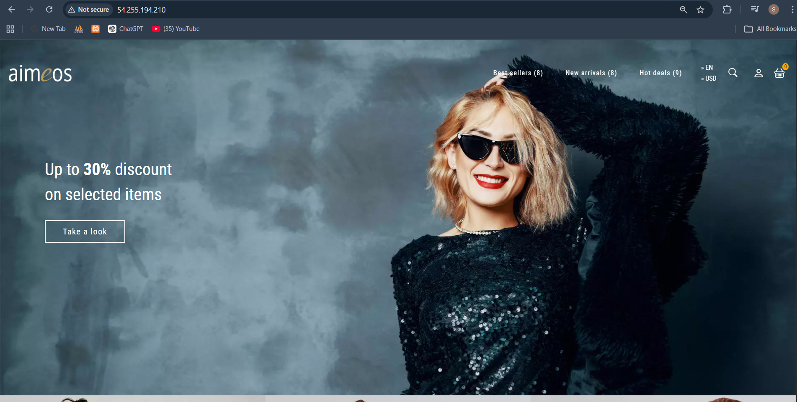
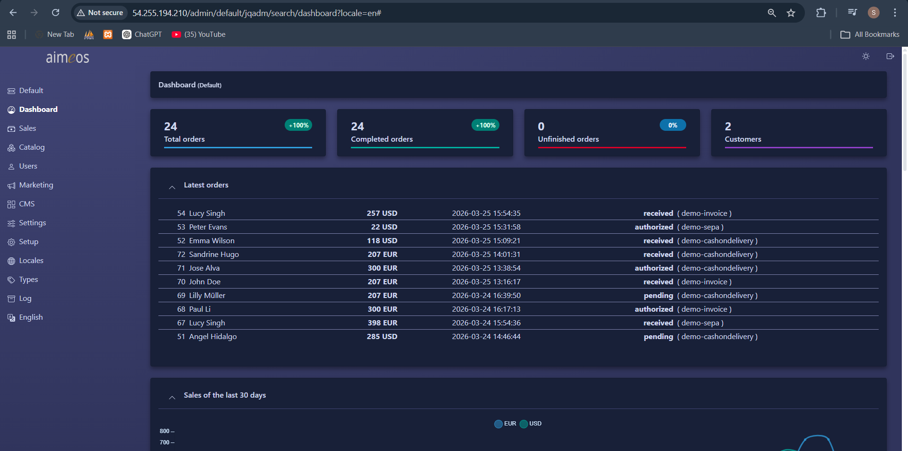
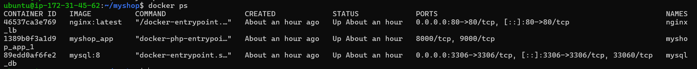
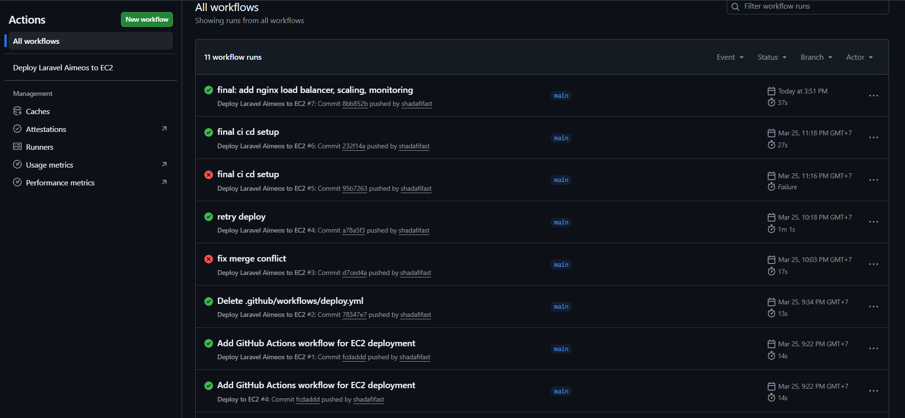

#  Aimeos Laravel Cloud Deployment (Full DevOps Project)

##  Deskripsi

Proyek ini merupakan implementasi aplikasi e-commerce berbasis Laravel (Aimeos) yang dideploy ke cloud menggunakan praktik DevOps modern.

Aplikasi dikontainerisasi menggunakan Docker, dideploy di AWS EC2, dilengkapi dengan CI/CD, monitoring, serta load balancing menggunakan NGINX.

---

##  Teknologi yang Digunakan

* Laravel + Aimeos
* Docker & Docker Compose
* AWS EC2 (Ubuntu)
* GitHub Actions (CI/CD)
* NGINX (Load Balancer)

---

## CI/CD Pipeline

Pipeline CI/CD dibuat menggunakan GitHub Actions yang berjalan otomatis setiap ada perubahan pada branch `main`.

Fitur pipeline:

* Build Docker image
* Deploy otomatis ke server EC2
* Restart container

---

##  Deployment

Aplikasi dideploy di AWS EC2 menggunakan Docker.

🔗 **Akses Aplikasi:**
http://54.255.194.210

---

##  Keamanan

* File `.env` tidak disimpan di repository
* Konfigurasi sensitif dipisahkan dari kode
* NGINX dikonfigurasi untuk memblokir file sensitif seperti `.env` dan `.git`

---

##  Monitoring

Monitoring dilakukan menggunakan:

* `htop` → monitoring CPU & RAM
* `docker stats` → monitoring container
* `df -h` → monitoring storage

---

##  Scaling

Scaling dilakukan menggunakan Docker Compose:

docker-compose up --scale app=2

Catatan:
Pada instance EC2 dengan resource terbatas, scaling penuh dibatasi untuk menjaga kestabilan sistem.

---

##  Load Balancer (NGINX)

NGINX digunakan sebagai reverse proxy untuk:

* Mendistribusikan traffic ke container Laravel
* Meningkatkan performa dan availability aplikasi

---

##  Admin Panel

Halaman admin dapat diakses melalui:

http://54.255.194.210/admin

Admin dibuat menggunakan Artisan CLI.

---

##  Kendala dan Solusi

###  Docker build gagal (composer install)

✔ Solusi:
Menjalankan `composer install` di host, bukan di dalam container

---

###  Error koneksi database

✔ Solusi:
Memperbaiki konfigurasi database dan user MySQL

---

### ❌ Konflik saat scaling container

✔ Solusi:
Menghapus `container_name` pada docker-compose

---

### ❌ Website error (502 Bad Gateway)

✔ Solusi:
Memastikan backend Laravel berjalan di port 8000

---

### ❌ Website berantakan (CSS tidak load)

✔ Solusi:
Memperbaiki konfigurasi NGINX agar tidak memblokir folder `vendor`

---

## 📸 Screenshots

### 🌍 Homepage

### 🔐 Admin Dashboard

### 🐳 Docker Containers

### 🔧 CI/CD Pipeline

## 📂 Repository

https://github.com/shadafifast/aimeos-laravel-deploy

---

## 👨‍💻 Author

Shadafi Fastiyan

---

## 🚀 Kesimpulan

Proyek ini menunjukkan kemampuan dalam:

* Deployment aplikasi ke cloud
* Implementasi CI/CD
* Containerization dengan Docker
* Monitoring sistem
* Load balancing dengan NGINX

Proyek ini siap digunakan sebagai portfolio profesional di bidang DevOps dan Cloud Engineering.
